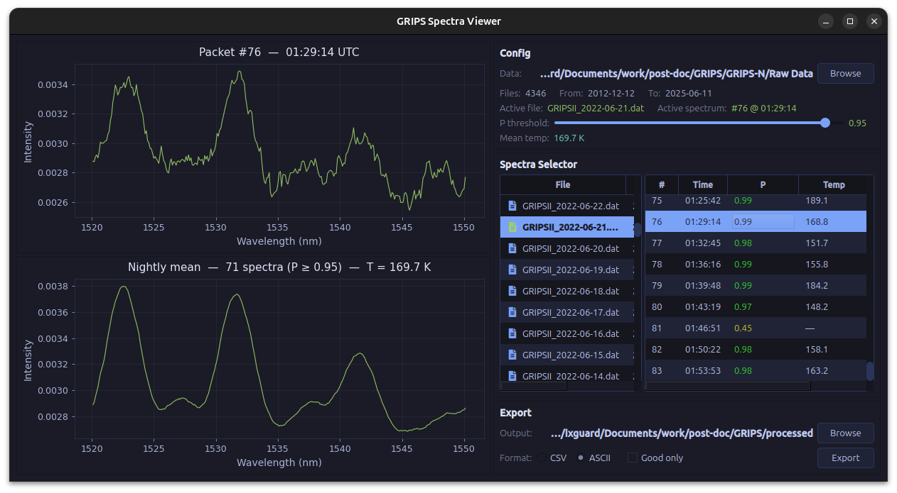
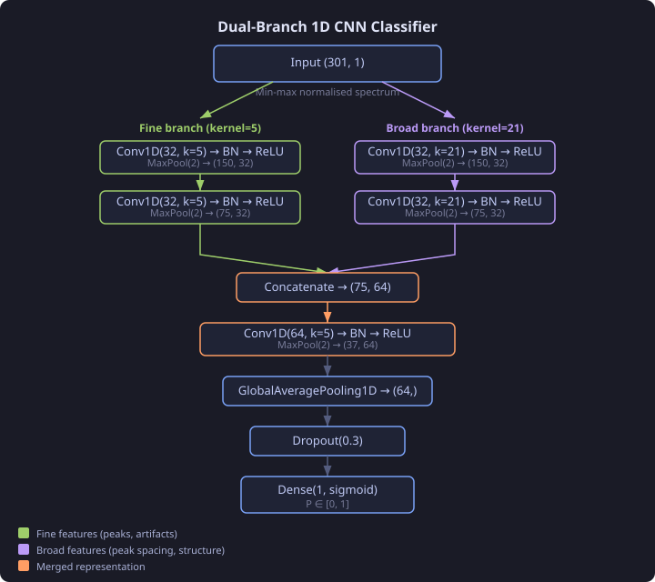
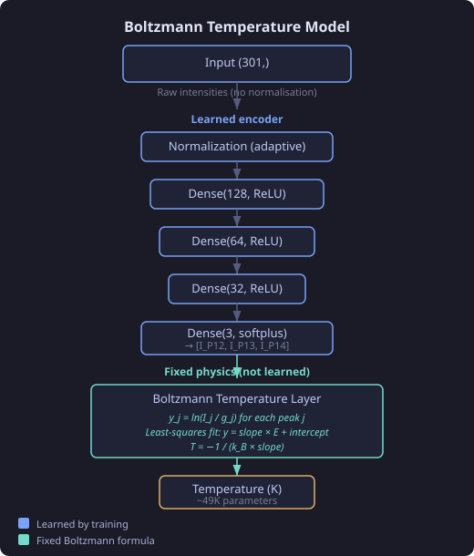

# GRIPS-N Spectra Viewer with Predictions

Browse raw GRIPS-N `.dat` files and use a neural network trained classifier and temperature prediction model for rapid initial analysis.



## Classifier

Dual-branch 1D CNN that predicts whether a spectrum is good or bad, outputting a confidence level from 0 (bad) to 1 (good). The threshold confidence P value can be set in the app (0.95 is a good starting point).



- Fine branch (kernel=5) detects small-scale features (individual peaks, noise artifacts)
- Broad branch (kernel=21) captures overall peak structure and spacing
- Input is min-max normalised per spectrum so the model learns shape, not absolute intensity

## Temperature

Physics-informed Boltzmann model. A dense encoder extracts 3 effective OH(3-1) P1-branch peak intensities from the full spectrum, then a fixed Boltzmann formula computes the rotational temperature.



- The neural network only learns to extract peak intensities; the temperature computation is a deterministic physics formula
- No normalisation of intensities (raw values needed for Boltzmann ratios)
- Spectroscopic constants from Schmidt et al. (2013) and Mies (1974)

## Usage notes

- The file browser expects `.dat` files with the naming convention `GRIPSII_YYYY-MM-DD.dat`
- The nightly mean temperature is computed as the arithmetic mean of all individual spectra where the P value is greater than or equal to the threshold. This usually gives a more accurate estimate for the nightly mean temperature than averaging all the individual spectra.
- Export either all or only good predictions to CSV or ASCII
- The colour of the individual spectrum plot line indicates good (green) or bad (red) based on the current P threshold
- Model performance benchmarks can be found in the sister repository: [grips-n-nn](https://github.com/hballington12/grips-n-nn) (training code, evaluation, diagnostics)
- Packets are 0-indexed. The first complete spectrum in a `.dat` file may not be packet 0 (partial scans at file boundaries are discarded).

## Installation

Download the latest release for your platform from [Releases](https://github.com/hballington12/grips-n-nn-app/releases):

| Platform | Format | Notes |
|----------|--------|-------|
| Linux | `.tar.gz` | Extract and run `./GRIPSSpectraViewer`. May need `chmod +x` first. |
| macOS (ARM) | `.dmg` | Open DMG, drag to Applications. First launch: right-click → Open to bypass Gatekeeper. |
| Windows | `.zip` | Extract and run `GRIPSSpectraViewer.exe`. SmartScreen: click "More info → Run anyway". |

## Development

Requires [uv](https://docs.astral.sh/uv/) and Python 3.11+.

```bash
uv sync
uv run python main.py
```
